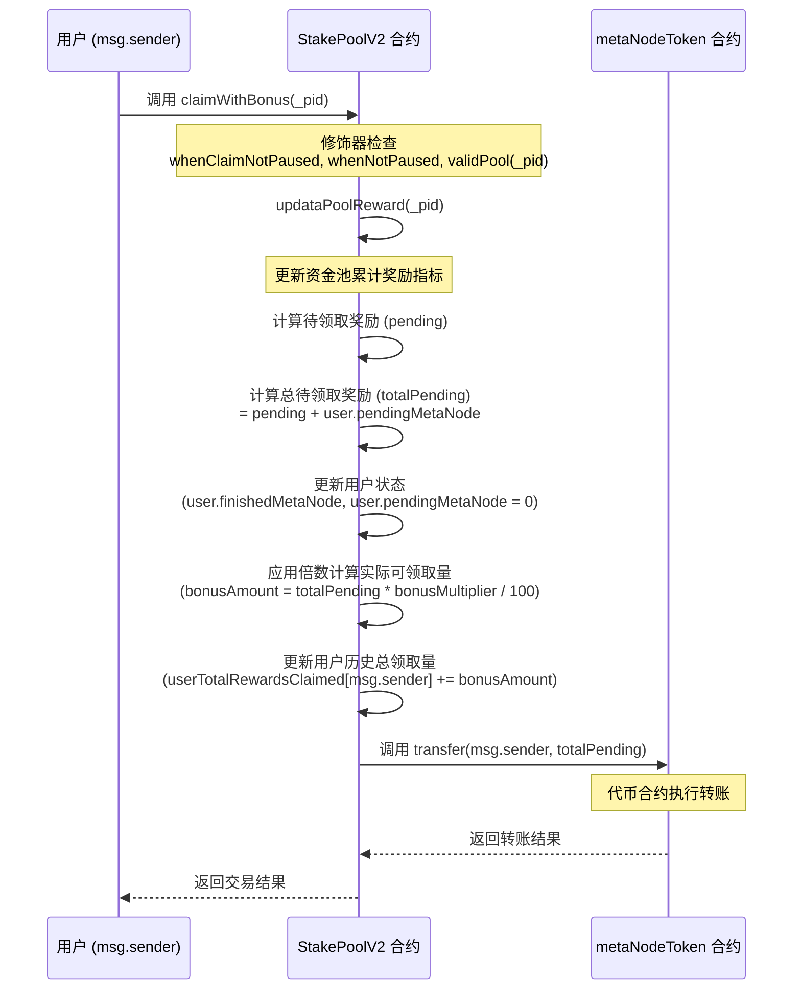

```markdown
# StakePoolV2 claimWithBonus 流程

## 序列图


```mermaid
sequenceDiagram
    participant U as 用户 (msg.sender)
    participant V2 as StakePoolV2 合约
    participant Token as metaNodeToken 合约

    U ->> V2: 调用 claimWithBonus(_pid)
    Note over V2: 修饰器检查<br/>whenClaimNotPaused, whenNotPaused, validPool(_pid)

    V2 ->> V2: updataPoolReward(_pid)
    Note over V2: 更新资金池累计奖励指标

    V2 ->> V2: 计算待领取奖励 (pending)
    V2 ->> V2: 计算总待领取奖励 (totalPending)<br/>= pending + user.pendingMetaNode
    V2 ->> V2: 更新用户状态<br/>(user.finishedMetaNode, user.pendingMetaNode = 0)

    V2 ->> V2: 应用倍数计算实际可领取量<br/>(bonusAmount = totalPending * bonusMultiplier / 100)
    V2 ->> V2: 更新用户历史总领取量<br/>(userTotalRewardsClaimed[msg.sender] += bonusAmount)

    V2 ->> Token: 调用 transfer(msg.sender, totalPending)
    Note over Token: 代币合约执行转账
    Token -->> V2: 返回转账结果
    V2 -->> U: 返回交易结果
```
```
